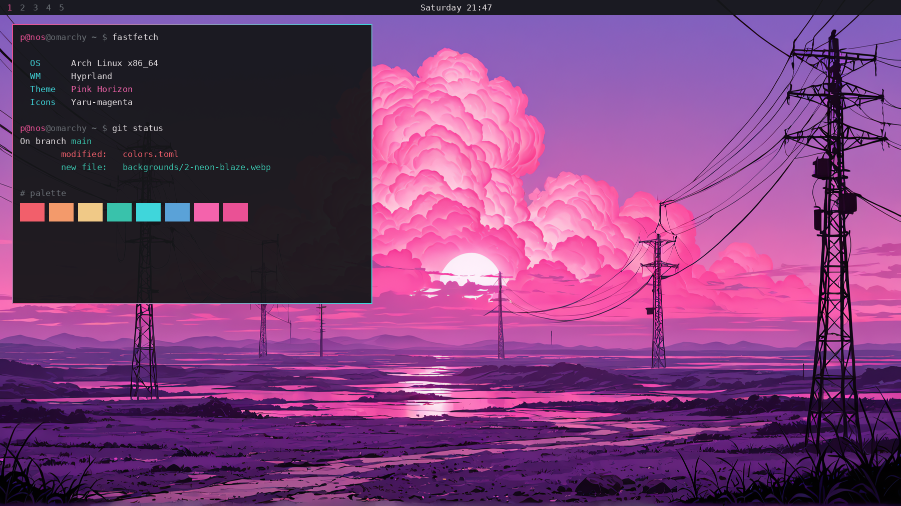
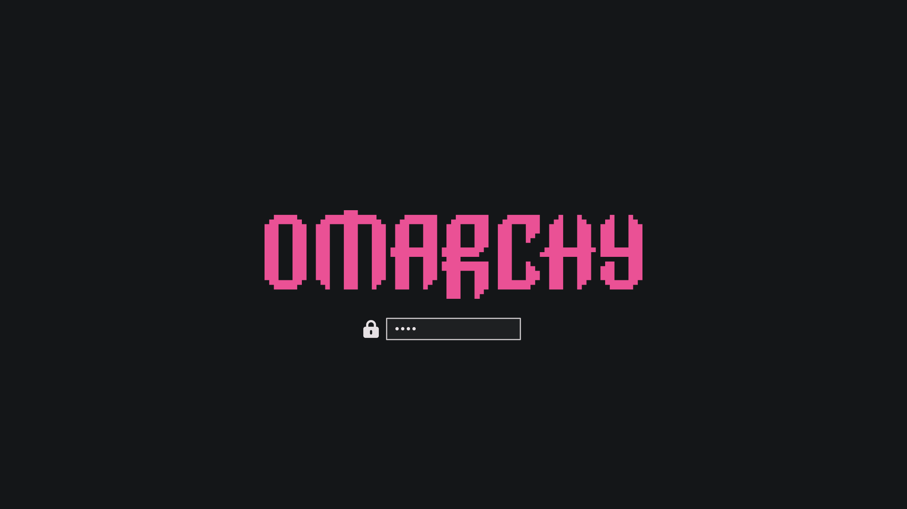
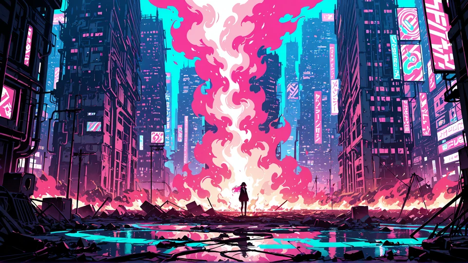
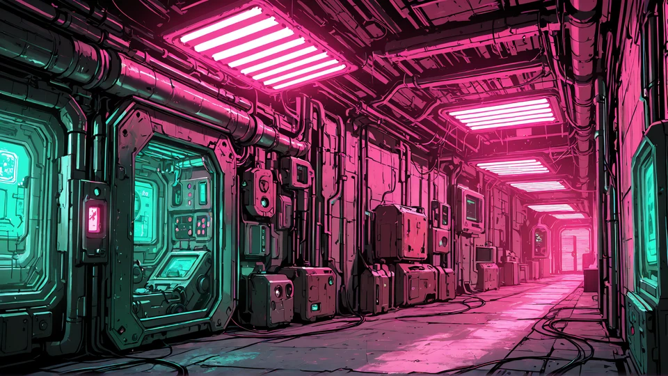

<div align="center">

# Pink Horizon

**A hot-pink and neon-cyan theme for [Omarchy](https://omarchy.org)**

Pink skies, neon cities, glowing labs, on a calm charcoal background. Five 4K wallpapers.




</div>

---

## Contents

- [Installation](#installation)
- [Screenshots](#screenshots)
- [Wallpapers](#wallpapers)
- [What gets themed](#what-gets-themed)
- [Extras: cliamp, Zen Browser, foot](#extras)
- [Palette](#palette)
- [Updating and removing](#updating-and-removing)
- [Troubleshooting](#troubleshooting)
- [Credits and license](#credits-and-license)

---

## Installation

> Requires a recent version of [Omarchy](https://omarchy.org) (tested on Omarchy 4).

### Option 1: Omarchy menu (recommended)

1. Press <kbd>Super</kbd> + <kbd>Alt</kbd> + <kbd>Space</kbd> to open the Omarchy menu.
2. Go to **Install → Style → Theme**.
3. Paste this URL and press <kbd>Enter</kbd>:

   ```
   https://github.com/padou-dev/omarchy-pink-horizon-theme.git
   ```

The theme is downloaded to `~/.config/omarchy/themes/pink-horizon` and applied right away.

### Option 2: Terminal

```bash
omarchy-theme-install https://github.com/padou-dev/omarchy-pink-horizon-theme.git
```

### Switching themes later

Open the theme picker with <kbd>Super</kbd> + <kbd>Ctrl</kbd> + <kbd>Shift</kbd> + <kbd>Space</kbd> and choose **Pink Horizon**.

> **Looking for the teal forest theme?** It's now called **[Teal Horizon](https://github.com/padou-dev/omarchy-teal-horizon-theme)**.

---

## Screenshots

| Desktop | Boot / unlock screen |
| :--: | :--: |
|  |  |

---

## Wallpapers

All wallpapers are **3840 × 2160**. Switch between them with the background picker: <kbd>Super</kbd> + <kbd>Ctrl</kbd> + <kbd>Space</kbd>.

| | |
| :--: | :--: |
|  |  |
| **1 · Power Lines** | **2 · Neon Blaze** |
|  |  |
| **3 · Pink Flame** | **4 · Cyan Lab** |
|  | |
| **5 · Pink Corridor** | |

---

## What gets themed

Omarchy generates every app's colors from this theme's single `colors.toml`, so all of these match automatically:

| Area | Apps |
|---|---|
| Desktop | Hyprland window borders (pink → cyan gradient), Omarchy shell: bar, launcher, notifications, OSD, lock screen |
| Terminals | Alacritty, Ghostty, Kitty, Foot |
| Editors | Neovim, VS Code, Helix, Obsidian |
| Browsers | Chromium, Brave, Brave Origin (toolbar color) |
| System | btop, GTK icons (Yaru-magenta), Plymouth boot screen |

---

## Extras

Some apps aren't themed by Omarchy itself. For these the repo ships ready-made files in [`extras/`](extras). Each needs a one-time setup.

<details>
<summary><b>cliamp</b> (terminal music player)</summary>

<br>

Link cliamp to the active Omarchy theme. This theme ships a `cliamp.toml`, so cliamp gets Pink Horizon's colors:

```bash
mkdir -p ~/.config/cliamp/themes
ln -sf ~/.local/state/omarchy/current/theme/cliamp.toml ~/.config/cliamp/themes/omarchy.toml
```

Then open cliamp, press <kbd>t</kbd> and pick **omarchy**, or set `theme = "omarchy"` in `~/.config/cliamp/config.toml`.

If you'd rather not link it, copy the file directly:

```bash
cp ~/.config/omarchy/themes/pink-horizon/extras/cliamp/pink-horizon.toml ~/.config/cliamp/themes/
```

</details>

<details>
<summary><b>Zen Browser</b></summary>

<br>

1. Open `about:config` and set `toolkit.legacyUserProfileCustomizations.stylesheets` to **true**.
2. Open `about:support`, then click **Profile Folder → Open Folder**.
3. Create a folder named `chrome` inside the profile folder.
4. Copy both CSS files into it:

   ```bash
   cp ~/.config/omarchy/themes/pink-horizon/extras/zen/*.css /path/to/zen/profile/chrome/
   ```

5. Make sure Zen is in dark mode, then restart it.

</details>

<details>
<summary><b>foot</b> (outside Omarchy)</summary>

<br>

On Omarchy, foot is themed automatically. For foot on another system, copy `extras/foot/pink-horizon.ini` to `~/.config/foot/` and add this line to `~/.config/foot/foot.ini`:

```ini
include=~/.config/foot/pink-horizon.ini
```

</details>

---

## Palette

| | Role | Hex | | Role | Hex |
|:-:|---|---|:-:|---|---|
|  | background | `#141618` |  | red | `#f25f6b` |
|  | foreground | `#e6e1e4` |  | orange | `#f39a6b` |
|  | accent | `#ea5195` |  | yellow | `#f0c987` |
|  | selection | `#3a2433` |  | green | `#39c2ab` |
|  | muted | `#6a6f75` |  | cyan | `#3fd6db` |
|  | bright foreground | `#f9eff5` |  | blue | `#5aa2d8` |
| | | |  | magenta | `#f463ac` |

---

## Updating and removing

| Task | Omarchy menu | Terminal |
|---|---|---|
| Update to the latest version | **Update → Extra Themes** | `omarchy-theme-update` |
| Remove the theme | **Remove → Theme** | `omarchy-theme-remove pink-horizon` |

---

## Troubleshooting

<details>
<summary><b>Install fails with "Failed to clone theme repo"</b></summary>

Check your internet connection and that the URL is exactly `https://github.com/padou-dev/omarchy-pink-horizon-theme.git`.
</details>

<details>
<summary><b>Updating fails with "refusing to merge unrelated histories"</b></summary>

You installed the *old* Pink Horizon (now [Teal Horizon](https://github.com/padou-dev/omarchy-teal-horizon-theme)) before it was renamed. Remove it and install this one fresh:

```bash
omarchy-theme-remove pink-horizon
omarchy-theme-install https://github.com/padou-dev/omarchy-pink-horizon-theme.git
```
</details>

<details>
<summary><b>A terminal didn't change color</b></summary>

Close and reopen it. Some terminals only read their colors at launch.
</details>

<details>
<summary><b>Icons didn't change</b></summary>

Check that the icon set is installed: `ls /usr/share/icons | grep -i yaru`.
</details>

<details>
<summary><b>cliamp shows its default colors</b></summary>

Check that the link points to a real file: `ls -l ~/.config/cliamp/themes/omarchy.toml`. It only resolves while a theme that ships `cliamp.toml` is active.
</details>

---

## Repository layout

```
.
├── backgrounds/          4K wallpapers (+ omarchy.webp logo backdrop)
├── extras/               manual-setup themes: cliamp, Zen Browser, foot
├── media/                README screenshots and wallpaper thumbnails
├── colors.toml           the palette every themed app is generated from
├── cliamp.toml           cliamp colors
├── icons.theme           icon set name
├── preview.png           theme-picker thumbnail
├── preview-unlock.png    boot/unlock screen preview
└── unlock.png            boot/unlock logo
```

---

## Credits and license

- Theme and wallpapers by **[p@nos](https://github.com/padou-dev)**. Wallpapers were upscaled to 4K with [Real-ESRGAN](https://github.com/xinntao/Real-ESRGAN).
- Built on the theme system of [basecamp/omarchy](https://github.com/basecamp/omarchy). The Zen styling follows the approach of [catppuccin/zen-browser](https://github.com/catppuccin/zen-browser).
- Sister theme: **[Teal Horizon](https://github.com/padou-dev/omarchy-teal-horizon-theme)**.

Released under the [MIT License](LICENSE).
